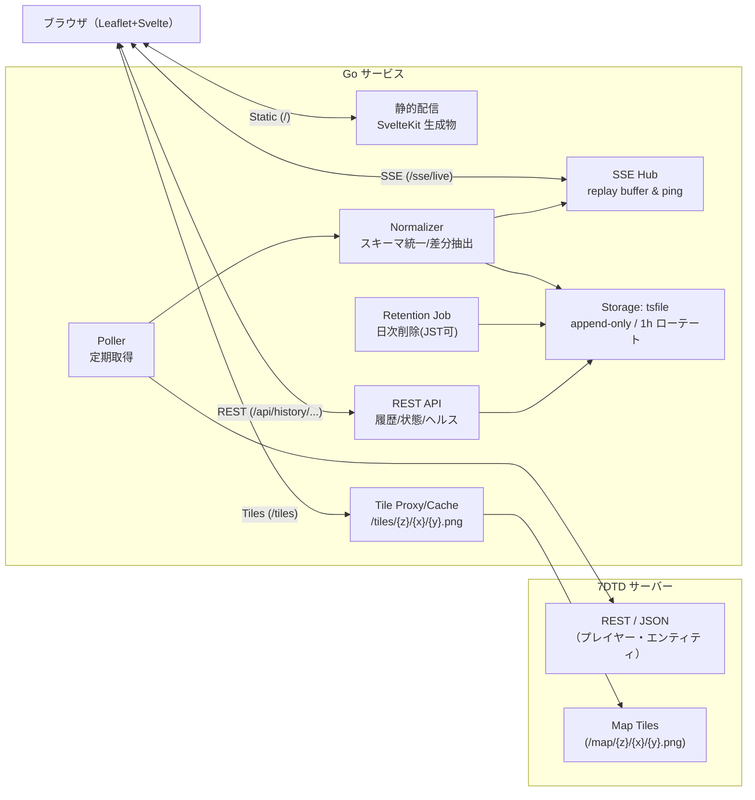

# 7DTD Live Map & Events Streaming Service — 設計仕様（tsfile 対応版）

（SvelteKit SSG + Go HTTP + Leaflet + SSE + tsfile）

## 概要

**7 Days to Die** サーバーの地図タイルと、プレイヤー／ゾンビの行動を**リアルタイム可視化**・**履歴参照**する Web アプリです。
フロントは **SvelteKit(SSG)** の静的ファイル、バックエンドは **Go 単体バイナリ**。ゲーム側 API を**定期ポーリング**し、差分を **SSE** で配信します。履歴データは、あなたが作成した **`tsfile`（タグ付き時系列ファイル）** で**軽量・依存ゼロ**に永続化します（時刻は UTC、NDJSON+gzip、1 時間ローテート）。

## 全体アーキテクチャ



---

## tsfile を用いたデータモデル

### シリーズ設計（推奨）

> ベクトル値は**軸ごと**に分け、スカラー（`Point.V`）に格納します。タグでプレイヤーやワールドを識別。

- `players.x` / `players.z` / `players.y`（オプション）

  - `V`: 各軸の座標（float64）
  - `Tags`:

    - `player_id`（例: `P:steam:7656...`）
    - `name`（任意・変動注意）
    - `world`（任意）
    - `src`（`allocs|vanilla|custom`）

- `players.speed`（任意）

  - `V`: m/s など
  - `Tags`: `player_id`, `world`, `src`

- `entities.x` / `entities.z`

  - `V`: 座標
  - `Tags`: `entity_id`, `type=zombie|animal|...`, `world`, `src`

- `events.count`

  - `V`: 常に `1`
  - `Tags`:

    - `kind=player_connect|player_disconnect|player_death|entity_spawn|entity_kill`
    - `player_id` or `entity_id`（該当あれば）
    - `world`, `src`

> 僕の意見：**名前（`name`）はタグに入れ過ぎない**のが安全。可視化に使う程度に留めて、集計キーは `player_id` を主に（意見です）。

### on-disk 配置（例）

```
data/
  players.x/<tagHash>/YYYY/MM/DD/HH.ndjson.gz
  players.z/<tagHash>/YYYY/MM/DD/HH.ndjson.gz
  events.count/<tagHash>/YYYY/MM/DD/HH.ndjson.gz
  ...
```

- タグ → 正規化 → `tagHash`（先頭 8 バイト）でディレクトリ分割。
- `labels.json` にタグ実体が残るので可観測性も良い。

---

## エンドポイント（変更なし/拡張）

- `GET /` / `/assets/*` … SvelteKit 生成物
- `GET /sse/live?...` … ライブ位置/イベント（**tsfile と独立**。ポーリング結果 → 差分 →SSE）
- `GET /tiles/{z}/{x}/{y}.png` … タイルプロキシ/キャッシュ
- `GET /api/map/info` … `{tileSize,maxNativeZoom,tms}`
- **`GET /api/history/tracks`（拡張）**

  - `?player_id=...&from=...&to=...&step=5s`
  - `tsfile.ScanRange` で `players.x` と `players.z` を読み、**時刻を量子化（例: 1s）して結合**→ 折れ線座標列を返す

- **`GET /api/history/events`（拡張）**

  - `?kind=player_death&from=...&to=...&player_id=...`
  - `events.count` をフィルタしヒットを返す

- `GET /healthz` / `GET /readyz`

---

## Go 実装スケッチ（tsfile 利用）

### 初期化（writer）

```go
// storage/tsstore.go
type TSStore struct {
  root string
  wrX  *tsfile.Router // players.x
  wrZ  *tsfile.Router // players.z
  wrE  *tsfile.Router // events.count
}

func NewTSStore(root string) *TSStore {
  return &TSStore{
    root: root,
    wrX:  tsfile.NewRouter(root, "players.x",
           tsfile.WithLocation(time.UTC),
           tsfile.WithFlushEvery(1000),
           tsfile.WithFlushInterval(2*time.Second)),
    wrZ:  tsfile.NewRouter(root, "players.z",
           tsfile.WithLocation(time.UTC),
           tsfile.WithFlushEvery(1000),
           tsfile.WithFlushInterval(2*time.Second)),
    wrE:  tsfile.NewRouter(root, "events.count",
           tsfile.WithLocation(time.UTC),
           tsfile.WithFlushEvery(100),
           tsfile.WithFlushInterval(2*time.Second)),
  }
}

func (s *TSStore) Close() error {
  _ = s.wrX.Close(); _ = s.wrZ.Close(); _ = s.wrE.Close()
  return nil
}
```

### 書き込み（Poller → tsfile.Append）

```go
func (s *TSStore) AppendPlayerPos(t time.Time, pid, world, src string, x, z float64, name string) {
  tags := map[string]string{"player_id": pid, "world": world, "src": src}
  if name != "" { tags["name"] = name } // 変動注意
  _ = s.wrX.Append(tsfile.Point{T: t, V: x, Tags: tags})
  _ = s.wrZ.Append(tsfile.Point{T: t, V: z, Tags: tags})
}

func (s *TSStore) AppendEvent(t time.Time, kind, id, world, src string, isPlayer bool) {
  tags := map[string]string{"kind": kind, "world": world, "src": src}
  if isPlayer { tags["player_id"] = id } else { tags["entity_id"] = id }
  _ = s.wrE.Append(tsfile.Point{T: t, V: 1, Tags: tags})
}
```

### 読み取り（座標の再構成）

```go
// tracks: 指定プレイヤーの [from,to] を 1秒粒度で復元
func (s *TSStore) LoadTrack(ctx context.Context, pid string, from, to time.Time) ([]struct{T time.Time; X,Z float64}, error) {
  // 1) X を読み込む
  xs := map[int64]float64 // unix秒→X
  err := tsfile.ScanRange(s.root, "players.x", from, to, func(p tsfile.Point) bool {
    if p.Tags["player_id"] != pid { return true }
    ts := p.T.Unix()
    xs[ts] = p.V
    return true
  })
  if err != nil { return nil, err }

  // 2) Z を読み込み、X と突合→座標列へ
  out := make([]struct{T time.Time; X,Z float64}, 0, len(xs))
  err = tsfile.ScanRange(s.root, "players.z", from, to, func(p tsfile.Point) bool {
    if p.Tags["player_id"] != pid { return true }
    ts := p.T.Unix()
    x, ok := xs[ts]; if !ok { return true } // 量子化窓を広げたいなら±1秒も検討
    out = append(out, struct{T time.Time; X,Z float64}{T: time.Unix(ts,0).UTC(), X:x, Z:p.V})
    return true
  })
  return out, err
}
```

> 量子化の粒度は `Poller` のサンプリング周期に合わせるのが吉（例：2 秒なら 2 秒単位）。ズレ吸収のため **±1 秒窓**で最寄りマッチにするのも手（意見です）。

### リテンション（日次削除、JST 境界）

```go
func (s *TSStore) Retention(days int) error {
  jst, _ := time.LoadLocation("Asia/Tokyo")
  boundary := time.Now().In(jst).AddDate(0,0,-days)
  for _, series := range []string{"players.x","players.z","players.y","players.speed","entities.x","entities.z","events.count"} {
    if err := tsfile.DeleteBeforeDay(s.root, series, boundary, jst); err != nil { return err }
  }
  return nil
}
```

---

## SSE / 履歴の連携方針

- **ライブ**：Poller → 差分抽出 → **SSE 直送**（低レイテンシ）
- **履歴**：API 呼び出し時に **`tsfile.ScanRange` で都度再構成**
  → インデックス不要・ディスクフットプリント小
- **再接続（Last-Event-ID）**：Hub の replay バッファで足りなければ、欠損期間のみ tsfile から補完してクライアントへ再送（任意実装）

---

## 設定例

```yaml
http_addr: ":8080"
static_dir: "./web"

game:
  base_url: "http://server:8082"
  tile_base_url: "http://server:8082/map"

poll_intervals:
  positions: "2s"
  events: "5s"

tiles:
  cache_dir: "./cache/tiles"
  ttl: "168h"

storage:
  tsfile_root: "./data" # ← tsfile ルート
  retention_days: 30 # ← 日次削除

auth:
  token: "change-me"
```

---

## 非機能要件・運用

- **一貫した UTC**：`tsfile` は UTC 正規化。UI 側で JST 表示に変換。
- **単一ライター原則**：同一（series, tagSet）に**複数プロセスから同時書き込みしない**。本サービスは単バイナリ運用なので OK。
- **Flush 設定**：`WithFlushInterval(1–2s)` 推奨（意見）。電源断の損失を数秒以内に抑制。
- **タグ設計**：`player_id` を主キーに。`name` は**必要時のみ**。タグのカーディナリティ膨張に注意（意見）。
- **バックアップ**：`data/` ディレクトリをそのまま rsync/スナップショットで取得可能。
- **systemd**：`KillSignal=SIGTERM` + `TimeoutStopSec=15s`（Close/Flush の猶予）

---

## テスト観点

- `players.x / players.z` の**突合精度**（量子化/窓幅のチューニング）
- ローテーション境界またぎ（HH→HH+1）でのデータ欠落が無いこと
- リテンション後に `labels.json` と本体の整合が保たれること
- 異常終了時の gzip 連結・先頭メンバー読取健全性

---

## まとめ

- **tsfile 採用で「軽量・依存ゼロ・運用簡便」** の狙いにきれいにハマりました。
- ベクトル値は**シリーズ分割**が定石で、復元は**オンデマンド再構成**がシンプル。まずはこれで十分戦えます。
- 将来、需要が増えたら **ダウンサンプリング用シリーズ（例：`players.x.ds10s`）** を追加して読み取りコストをさらに下げられます
