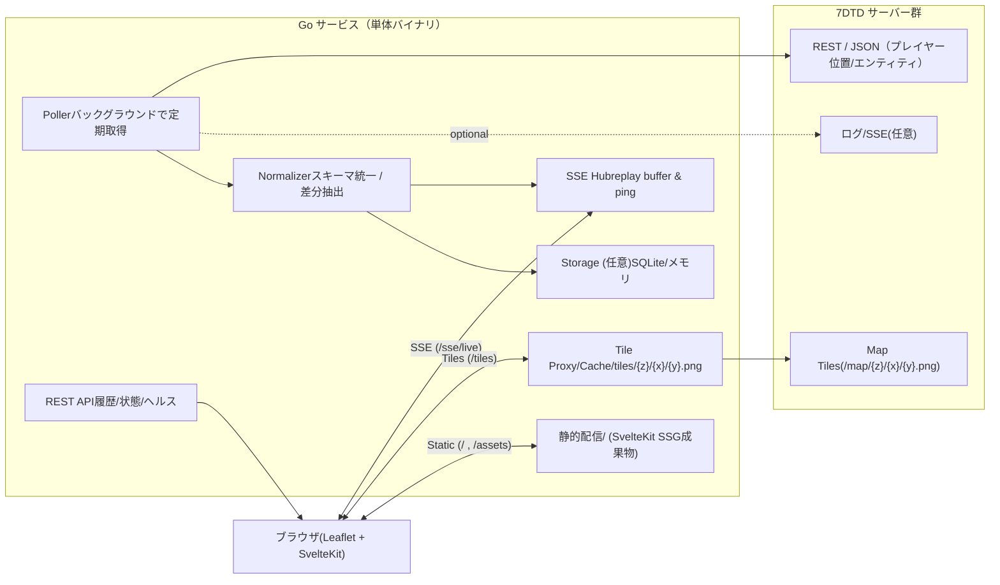

# 7DTD Live Map & Events Streaming Service — 設計仕様

（SvelteKit SSG + Go HTTP + Leaflet + SSE）

## 概要

本サービスは、**7 Days to Die** サーバーの地図タイルとプレイヤー／ゾンビの行動イベントを、**軽量で保守しやすい構成**で可視化するためのウェブアプリです。
フロントは **SvelteKit の SSG** で生成した静的ファイルを用い、バックエンドは **Go の単体バイナリ**が一括で提供します。
Go サービスはゲーム側 API を**定期ポーリング**して位置・イベントを取得し、差分抽出のうえ **SSE（/sse/live）** でブラウザへリアルタイム配信します。
地図は **Leaflet** を使用し、**/tiles/{z}/{x}/{y}.png** でゲーム側のタイルを**プロキシ＆キャッシュ**して配信します。

エンドポイントは、静的配信（`/`）、SSE（`/sse/live`）、タイル（`/tiles/…`）、地図メタ情報（`/api/map/info`）、ヘルスチェック（`/healthz`）を中核として設計。
SSE は **Last-Event-ID によるリプレイ**と**定期 ping**を備え、ネットワーク断に強い運用を想定します。
ID は **プラットフォーム非依存の抽象化**を採用し（例: `P:<platform>:<id>`）、将来のゲーム更新に伴う影響を最小化します。
ストレージは任意で **SQLite** を選択可能（軌跡の履歴取得や間引き提供に利用）。

この構成により、**UI は完全静的・配信はストリーム・地図はキャッシュ**という役割分担が明確になり、初期実装から運用拡張（履歴 API、権限、メトリクス、スケールアウト）まで段階的に成長できます。
※僕の意見ですが、**SvelteKit(SSG) + Go + SSE + タイルプロキシ**は実装速度と保守性のバランスが非常に良い選択です。

## 全体アーキテクチャ



## エンドポイント設計（Go 側）

- `GET /` / `/assets/*`

  - SvelteKit のビルド成果物をそのまま配信（SSG）。

- `GET /sse/live?topics=pos,events&players=all|id1,id2&entities=zombie|animal|*`

  - **サーバー送信イベント（SSE）**：位置サンプル・接続/切断・死亡・spawn/kill などを push。
  - `Last-Event-ID` 対応、`id:` 付きでリプレイ可能、`:ping` コメントを 10–15s に一度送出（切断検知用）。

- `GET /tiles/{z}/{x}/{y}.png`

  - **タイル・プロキシ/キャッシュ**。ゲーム側 API をフェッチし、**ディスクキャッシュ**して二度目以降はローカルから返す（ETag/If-Modified-Since 対応推奨）。

- `GET /api/map/info`

  - `{ tileSize: 128, maxNativeZoom: 4, tms:true }` 等、クライアントが Leaflet 設定に使うメタ情報。

- `GET /api/history/tracks?player_id=xxx&from=...&to=...&step=5s`（任意）

  - 過去の軌跡返却（SQLite があれば）。`step` で間引き。

- `GET /api/players` / `GET /api/entities`（任意）

  - ポーリング結果のスナップショットを REST で返却。

- `GET /healthz` / `GET /readyz`

  - ヘルスチェック。

## データ取得（Poller）

- **pull 間隔**：例 `positions: 1–2s`、`entities: 2–5s`、`serverinfo: 10–30s`
  （僕の意見：初期は 2s/5s/30s 程度で十分。利用者が増えたらバックオフ/適応化）
- **差分抽出**：前回サンプルと比較し、**変化したプレイヤー/エンティティのみ SSE** で送る（帯域節約）。
- **リトライ**：指数バックオフ + ジッタ、上限到達で**デグレード**（SSE に“source=degraded”イベント）。

## イベントスキーマ（SSE `event:` 名 + `data:` JSON）

```jsonc
// event: player_pos
{
  "t": "2025-08-26T13:37:20Z",
  "player_id": "P:platform:12345",
  "name": "Alice",
  "x": 123.4,
  "z": -456.7,
  "y": 62.0,        // 任意
  "speed": 3.2,     // 任意（差分から算出）
  "src": "allocs|vanilla|custom"
}

// event: player_connect / player_disconnect
{ "t": "...", "player_id": "...", "name":"Alice" }

// event: player_death
{ "t": "...", "player_id":"...", "name":"Alice", "cause":"zombie" }

// event: entity_spawn / entity_kill  (type は "zombie" など)
{ "t":"...", "entity_id":"E:...", "type":"zombie", "x":..., "z":..., "meta":{ "zombieClass":"..." } }
```

- **ID 抽象化**：`player_id` は `PlatformUserIdentifierAbs` を元に `"P:<platform>:<id>"` へ正規化（Steam 等に直依存しない）。
- **将来互換**：`meta` バケットで拡張。

## Go パッケージ構成（例）

```
/cmd/sdtd-map-server/main.go
/internal/config/...
/internal/ssehub/hub.go
/internal/game/client.go           // インターフェース
/internal/game/allocs_adapter.go   // Allocs系
/internal/game/vanilla_adapter.go  // 標準WebAPI系（あれば）
/internal/poller/poller.go
/internal/tiles/proxy.go
/internal/storage/sqlite.go        // 任意
/web/                              // SvelteKit の静的成果物
```

## 主要コード骨子（要点のみ）

### main.go（net/http 素で OK）

```go
package main

import (
  "log"
  "net/http"
  "time"

  "sdtd/internal/config"
  "sdtd/internal/ssehub"
  "sdtd/internal/game"
  "sdtd/internal/poller"
  "sdtd/internal/tiles"
  "sdtd/web" // embed する場合は embed.FS をここに
)

func main() {
  cfg := config.Load() // env/yaml: GAME_BASE_URL, TILE_BASE_URL, POLL_INTERVALS, CACHE_DIR, AUTH_TOKEN...
  hub := ssehub.NewHub(1024, 15*time.Second) // replay=1024件, ping=15s
  go hub.Run()

  gc := game.NewClient(cfg)          // Adapterを内部で選択
  plr := poller.New(gc, hub, cfg)    // 位置/イベントをpull→差分→hubへbroadcast
  go plr.Run()

  mux := http.NewServeMux()

  // SSE
  mux.HandleFunc("/sse/live", hub.ServeSSE)

  // Map tiles proxy/cache
  tileHandler := tiles.NewProxy(cfg.TileBaseURL, cfg.CacheDir, tiles.Options{TTL: 7*24*time.Hour})
  mux.Handle("/tiles/", http.StripPrefix("/tiles/", tileHandler))

  // Map info
  mux.HandleFunc("/api/map/info", func(w http.ResponseWriter, r *http.Request) {
    w.Header().Set("Content-Type", "application/json")
    w.Write([]byte(`{"tileSize":128,"maxNativeZoom":4,"tms":true}`))
  })

  // Health
  mux.HandleFunc("/healthz", func(w http.ResponseWriter, r *http.Request) { w.WriteHeader(200) })

  // Static (SvelteKit 生成物)
  // 1) OS配布なら nginx 等で / を別配信でもOK
  // 2) Goバイナリに embed するなら http.FS で。
  mux.Handle("/", http.FileServer(http.Dir(cfg.StaticDir)))

  srv := &http.Server{
    Addr:         cfg.HTTPAddr,
    Handler:      withBasicMiddleware(mux, cfg), // CORS, gzip(※SSEは除外), logging, auth token
    ReadTimeout:  15 * time.Second,
    WriteTimeout: 0, // SSE は無限ストリームなので0（タイムアウトしない）
  }
  log.Println("listening on", cfg.HTTPAddr)
  log.Fatal(srv.ListenAndServe())
}
```

### SSE Hub（replay + ping）

```go
// ssehub/hub.go (抜粋)
type Event struct {
  ID    string
  Name  string // "player_pos" など
  Data  []byte // JSON
}

type Hub struct {
  register   chan chan<- Event
  unregister chan chan<- Event
  broadcast  chan Event
  clients    map[chan<- Event]struct{}
  replay     *ring.Ring // 直近N件
  pingEvery  time.Duration
}

func (h *Hub) ServeSSE(w http.ResponseWriter, r *http.Request) {
  flusher, ok := w.(http.Flusher); if !ok { http.Error(w, "stream unsupported", 500); return }
  w.Header().Set("Content-Type", "text/event-stream")
  w.Header().Set("Cache-Control", "no-cache")
  w.Header().Set("X-Accel-Buffering", "no") // nginx等のバッファ無効

  ch := make(chan Event, 64)
  h.register <- ch
  defer func(){ h.unregister <- ch }()

  // Last-Event-ID リプレイ
  if last := r.Header.Get("Last-Event-ID"); last != "" { h.ReplayFrom(w, last) }

  // ping goroutine
  stop := make(chan struct{})
  go func() {
    ticker := time.NewTicker(h.pingEvery)
    defer ticker.Stop()
    for {
      select {
      case <-ticker.C:
        w.Write([]byte(":ping\n\n"))
        flusher.Flush()
      case <-stop:
        return
      }
    }
  }()

  // 配信ループ
  notify := r.Context().Done()
  for {
    select {
      case ev := <-ch:
        w.Write([]byte("id: " + ev.ID + "\n"))
        if ev.Name != "" { w.Write([]byte("event: " + ev.Name + "\n")) }
        w.Write([]byte("data: "))
        w.Write(ev.Data)
        w.Write([]byte("\n\n"))
        flusher.Flush()
      case <-notify:
        close(stop); return
    }
  }
}
```

### Poller（差分抽出 → SSE）

```go
// poller/poller.go (抜粋)
type Poller struct {
  gc   game.Client
  hub  *ssehub.Hub
  cfg  Config
  last map[string]Position // player_id -> last pos
}

func (p *Poller) Run() {
  posTicker := time.NewTicker(p.cfg.PosInterval)
  evtTicker := time.NewTicker(p.cfg.EventInterval)
  defer posTicker.Stop(); defer evtTicker.Stop()

  for {
    select {
      case <-posTicker.C:
        players, err := p.gc.ListPlayers(); if err != nil { continue }
        for _, pl := range players {
          prev, ok := p.last[pl.ID]
          if !ok || changedEnough(prev, pl.Position) {
            p.hub.EmitJSON("player_pos", jsonObj{/* fill */})
            p.last[pl.ID] = pl.Position
          }
        }
      case <-evtTicker.C:
        evs, _ := p.gc.ListEvents() // connect/disconnect/death/spawn/kill
        for _, ev := range evs { p.hub.EmitJSON(ev.Name, ev.Payload) }
    }
  }
}
```

### Tile Proxy/Cache（シンプル版）

```go
// tiles/proxy.go (抜粋)
type Proxy struct {
  base   *url.URL
  cache  string // ディスクディレクトリ
  ttl    time.Duration
  client *http.Client
}

func (p *Proxy) ServeHTTP(w http.ResponseWriter, r *http.Request) {
  // /{z}/{x}/{y}.png
  local := filepath.Join(p.cache, r.URL.Path)
  if fi, err := os.Stat(local); err == nil && time.Since(fi.ModTime()) < p.ttl {
    http.ServeFile(w, r, local); return
  }
  // fetch upstream
  upstream := p.base.ResolveReference(&url.URL{Path: r.URL.Path})
  resp, err := p.client.Get(upstream.String()); if err != nil { http.Error(w, "upstream", 502); return }
  defer resp.Body.Close()
  // ensure dir
  os.MkdirAll(filepath.Dir(local), 0o755)
  // tee to file + client
  f, _ := os.Create(local); defer f.Close()
  w.Header().Set("Content-Type", "image/png")
  io.Copy(io.MultiWriter(w, f), resp.Body)
}
```

## SvelteKit + Leaflet（受信/描画の最小例）

```ts
// +page.svelte（概略）
import { onMount } from "svelte";
import "leaflet/dist/leaflet.css";
import L from "leaflet";

let map: L.Map;
let poly: L.Polyline;
const path: L.LatLngExpression[] = [];

onMount(() => {
  const resp = await fetch("/api/map/info");
  const info = await resp.json();
  map = L.map("map", { crs: L.CRS.Simple }).setView([0, 0], Math.max(0, info.maxNativeZoom - 5));
  L.tileLayer("/tiles/{z}/{x}/{y}.png", { tms: info.tms, tileSize: info.tileSize, maxNativeZoom: info.maxNativeZoom }).addTo(map);
  poly = L.polyline([], { weight: 3 }).addTo(map);

  const es = new EventSource("/sse/live?topics=pos,events");
  es.addEventListener("player_pos", (e: MessageEvent) => {
    const m = JSON.parse(e.data);
    path.push([m.z, m.x]); // 7DTDは (Z, X) を Leaflet の (lat, lng) に
    poly.setLatLngs(path);
  });
});
```

## 重要な非機能要件

- **SSE の圧縮**：プロキシのバッファリング問題を避けるため、**SSE では gzip を無効**（静的/タイルには gzip/ETag を有効）。
- **CORS/認可**：内部利用でなければ `Authorization: Bearer` の**簡易トークン**を導入。SSE も手動で検証。
- **レート制御**：クライアント 1 つあたりの送信レートを上限化（例: 50msg/s）。Hub キューはドロップ戦略あり（古い位置を間引く）。
- **メトリクス**：Prometheus `/metrics`（poll 遅延、SSE 接続数、タイル HIT/MISS、上流エラー率）。
- **永続化**（任意）：SQLite + WAL、位置は TTL ローテーション（例: 30 日）＋ step 間引き。高負荷時は「直近 5 分は 1s 粒度、以降は 10s 粒度」など多段圧縮。
- **ゲーム API 差異の吸収**：`internal/game.Client` インターフェースで **Allocs/標準 WebAPI/自作 Mod** の差を吸収。

## 設定例（env / YAML）

```yaml
http_addr: ":8080"
static_dir: "./web"
game:
  base_url: "http://server:8082" # RESTの上流
  tile_base_url: "http://server:8082/map"
poll_intervals:
  positions: "2s"
  events: "5s"
tiles:
  cache_dir: "./cache/tiles"
  ttl: "168h" # 7日
auth:
  token: "change-me"
```

## 運用ポイント（僕の意見）

- **まずは SQLite なしで**（メモリ保持 + SSE だけ）立ち上げ、次に履歴 API を足すのが早いです。
- タイルは**初回アクセスで都度キャッシュ**に落とす方式がシンプルで堅い（事前プリフェッチは後回し）。
- ポーリングは**まず 2 秒**、負荷やネットワーク状況を見て調整で十分。
