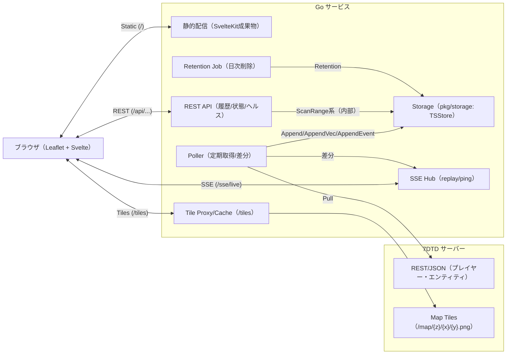

# 7DTD Live Map & Events Streaming Service — 設計仕様

**最終更新:** 2025-08-27 (JST)
**構成:** SvelteKit(SSG) + Go HTTP + Leaflet + SSE + `pkg/storage`（内部で `pkg/tsfile` を使用）

---

## 1. 目的 / スコープ

- 7DTD サーバーの**地図タイル**と**プレイヤー/ゾンビの行動・イベント**を**リアルタイム可視化**＋**履歴参照**。
- フロントは **SvelteKit の SSG** 静的配信、バックエンドは **Go 単体バイナリ**。
- 時系列データの永続化は **`pkg/storage`** を利用（内部で `tsfile` に append-only 保存、期限管理は Retention）。

### 非目標

- 分散レプリケーション、強整合クラスタ、重い集計エンジン（必要なら別レイヤで拡張）。

---

## 2. 全体アーキテクチャ



---

## 3. データモデル（`pkg/storage` の使い方）

### シリーズ（series）とタグ

- 位置（ベクトル）は**軸ごと**にシリーズ分割：

  - `players.x`, `players.z`（必要に応じ `players.y`）
  - タグ例：`player_id`, `world`, `src`（`name` は可変なので最小限）

- イベント（カウント型）：

  - `events.count`（`kind=player_connect|player_disconnect|player_death|entity_spawn|entity_kill` など）
  - 関連 ID は `player_id` または `entity_id`

> 書き込み API
>
> - 位置：`TSStore.AppendVec("players", t, map[string]float64{"x":X,"z":Z}, tags)`
> - イベント：`TSStore.AppendEvent(t, "player_connect", tags)`
> - 汎用：`TSStore.Append(series, point)`

---

## 4. 主要コンポーネント

### 4.1 Poller

- ゲーム API を**定期ポーリング**し、**差分抽出**。
- **書き込み**：`pkg/storage` へ

  - プレイヤー位置 → `AppendVec("players", ...)`
  - イベント → `AppendEvent(...)`

- **SSE**：変化分のみ SSE Hub に push（帯域節約）。
- 推奨間隔（目安）：
  位置 2s、イベント 5s、サーバー情報 30s（負荷に応じ調整。意見です）

### 4.2 Storage（`pkg/storage`）

- `TSStore` が**シリーズ名 →Router を遅延生成**して共有（動的シリーズにも対応）。
- **Retention**：日次 or 任意タイミングで `Retention(days, loc, series...)`。
  `series` 省略時は `root` 直下の**全シリーズを自動列挙**して削除適用。

### 4.3 SSE Hub

- `event:` 名＋ `data:` JSON を配信。`Last-Event-ID` 対応、`id:` 連番、`:ping` を 10–15s 間隔で送出。
- プレイヤー軌跡はフロントで `L.polyline` に逐次追加。

### 4.4 Tile Proxy/Cache

- `GET /tiles/{z}/{x}/{y}.png` → ゲーム側 `.../map/...` へプロキシし**ディスクキャッシュ**（ETag/TTL）。

### 4.5 REST API

- `GET /api/map/info` → `{ tileSize, maxNativeZoom, tms }`
- `GET /api/history/tracks?player_id&from&to&step`
  → `players.x`/`players.z` を `ScanRange` 相当で読んで**時刻量子化**・突合 → 折れ線座標列を返す
- `GET /api/history/events?kind&from&to&player_id&entity_id`
  → `events.count` をフィルタ

---

## 5. エンドポイント定義（概要）

- `GET /` / `/assets/*`：SvelteKit (SSG) 成果物
- `GET /sse/live?topics=pos,events&players=all|id1,...`：SSE
- `GET /tiles/{z}/{x}/{y}.png`：タイル
- `GET /api/map/info`：地図メタ
- `GET /api/history/tracks`：軌跡復元
- `GET /api/history/events`：イベント列挙
- `GET /healthz` / `GET /readyz`：ヘルス

---

## 6. ストレージ利用詳細

### 6.1 追記（書き込み）

- 位置：

  ```go
  store.AppendVec("players", t,
    map[string]float64{"x": X, "z": Z},
    map[string]string{
      "player_id": pid, "world": world, "src": source, // name は任意
    })
  ```

- イベント：

  ```go
  store.AppendEvent(t, "player_death",
    map[string]string{"player_id": pid, "world": world, "src": source})
  ```

### 6.2 読み取り（履歴）

- `tracks`：`players.x` と `players.z` を `ScanRange` 相当で読み、\*\*同一粒度に量子化（例: 1s）\*\*して時刻で突合。

  - サンプリングずれ吸収に ±1s 窓で最寄り一致（僕の意見：実運用で効きます）。

- `events`：`events.count` をタグでフィルタ。

### 6.3 リテンション

- 例：JST で 30 日保持

  ```go
  jst, _ := time.LoadLocation("Asia/Tokyo")
  _ = store.Retention(30, jst) // series 省略 → 全シリーズに適用
  ```

> 注意：**読み取り前は可能なら `Close()`**（gzip フッター確定）。
> 書き込み継続しながら読む要件が出たら、短ローテ or セグメント切替 API の導入を検討（意見です）。

---

## 7. フロント（Leaflet）連携要点

- `L.tileLayer('/tiles/{z}/{x}/{y}.png', { tms:true, tileSize:128, maxNativeZoom:4 })`
- SSE `player_pos` で `[z, x]` を `LatLng` に追加して `L.polyline` 更新
- 初期表示用に `/api/history/tracks` を呼んで直近 N 分の折れ線を描画 →SSE で継続

---

## 8. 設定例（YAML）

```yaml
http_addr: ":8080"
static_dir: "./web"

game:
  base_url: "http://server:8082"
  tile_base_url: "http://server:8082/map"

poll_intervals:
  positions: "2s"
  events: "5s"

tiles:
  cache_dir: "./cache/tiles"
  ttl: "168h"

storage:
  tsfile_root: "./data"
  retention_days: 30
  # storage の WriterOpt はコード側で:
  #   WithLocation(UTC), WithFlushEvery(1000), WithFlushInterval(2s)

auth:
  token: "change-me"
```

---

## 9. 非機能要件

- **可用性**：SSE 切断時は再接続（`Last-Event-ID`）で追従。Hub は replay を N 件保持。
- **性能**：差分配信・SSE の ping で死活管理。タイルはディスクキャッシュ。
- **信頼性**：`Append-only`、短い `FlushInterval`（1–2s）で電源断時の損失最小化。
- **セキュリティ**：`Authorization: Bearer` で簡易認可。CORS 制御。`labels.json` に機微情報を入れない。
- **監視**：Prometheus `/metrics`（ポーリング遅延、SSE 接続数、タイル HIT/MISS、書込件数、Retention 時間）。

---

## 10. コンポーネント責務（抜粋）

- Poller：API 取得 → 差分 →`store.Append*` & SSE push、指数バックオフ＋ジッタ。
- Storage（TSStore）：シリーズの**動的確保**、`Append/AppendVec/AppendEvent`、`Retention`。
- SSE Hub：配信・ping・replay、レート制御（古い位置の間引き）。
- Tile Proxy：上流フェッチ＋キャッシュ、ETag/TTL 管理。
- REST：履歴復元のための軽量結合 API。

---

## 11. テスト観点

- Poller 疑似入力で `AppendVec/AppendEvent` が正しく保存される
- `Close()` 後の履歴 API が `unexpected EOF` を出さずに読める
- `Retention`（series 省略時の**自動列挙**を含む）で古い日付が削除される
- SSE の再接続（`Last-Event-ID`）と replay

---

## 12. ロールアウト手順（簡略）

1. タイルプロキシ・静的配信のみで起動（`/tiles`, `/` の確認）
2. Poller を ON（SSE にダミー配信 → Leaflet 折れ線表示確認）
3. `pkg/storage` 書込 ON（`./data` にファイル生成）
4. `/api/history/*` の参照と Retention Job（cron/systemd timer）を導入
5. 認可・メトリクスを有効化

---

## 13. まとめ（僕の意見）

- `pkg/storage` を芯に据えることで、**シリーズ追加・タグ増減・期限管理**が全部 “軽く” なるのが強み。
- まずは **`players.(x|z)` + `events.count`** の最小セットで着手し、需要に応じて
  `players.speed` や `entities.(x|z)`、ダウンサンプリング系列を足すのが良いと思います（意見です）。
