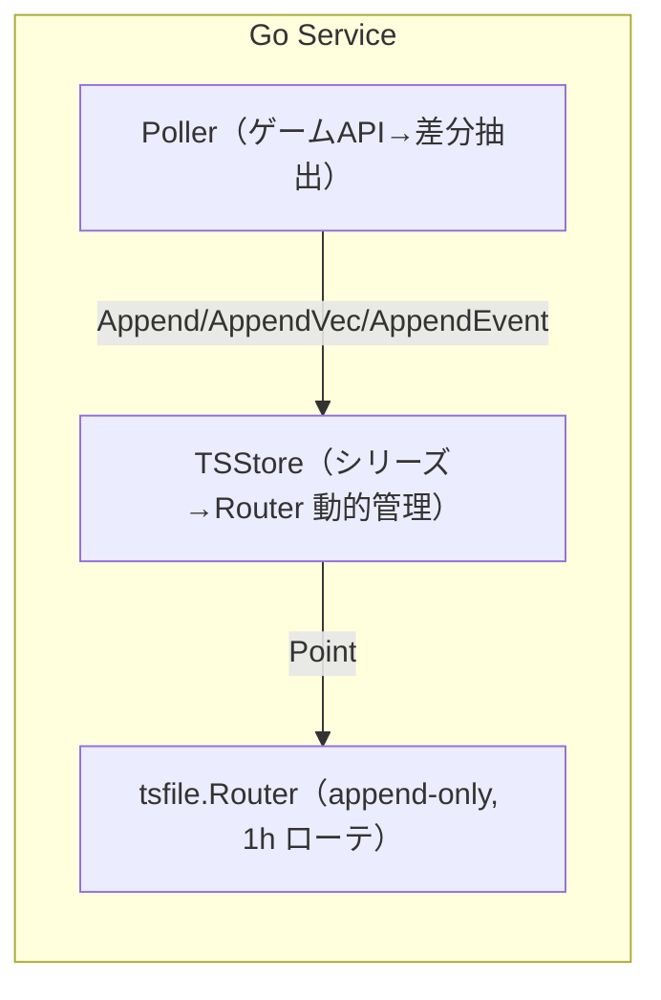

# pkg/storage 仕様書 v0.2

**モジュール名:** `github.com/masahide/7dtd-stats/pkg/storage`
**最終更新:** 2025-08-27 (JST)
**ステータス:** Draft / Experimental
**対象:** Go 1.22+／Linux 前提（他 OS でも動作想定）
**依存:** `github.com/masahide/7dtd-stats/pkg/tsfile`

> 目的に合わせて軽量・依存最小で設計しています（私の意見です）。大規模運用ではパラメータ調整や監視の追加を推奨。

---

## 1. 目的・スコープ

`pkg/storage` は、7DTD のプレイヤー／エンティティ位置や各種イベントを**シリーズ（series）単位**で時系列保存し、
\*\*リアルタイム追記（append-only）**と**期限管理（retention）\*\*を提供するストレージ層です。
オンディスク構造は `pkg/tsfile` に委譲し、**シリーズ増減・タグ増減に動的対応**します。

### 非目標（Non-goals）

- 高度なクエリ計画／集計エンジン（必要なら別レイヤで実装）
- 分散レプリケーション／強整合クラスタリング
- 同一シリーズ・同一タグ集合への**多プロセス同時書き込み**（避ける）

---

## 2. 用語とデータモデル

- **シリーズ（series）**: 記録対象の論理名。例: `players.x`, `players.z`, `events.count` など。
  ベクトル値（位置 X/Z/Y）は**軸ごとにシリーズ分割**するのが前提。
- **タグ（tags）**: `map[string]string`。`player_id`, `world`, `src` などで系列内のサブ系列を識別。
- **tsfile**: 時間 1 時間ごとにローテーションされる `NDJSON+gzip` への append-only 形式。

> 私見: `player_id` を主キーに据え、`name` のような可変タグは必要最小限に抑えるのが保守的。

---

## 3. アーキテクチャ概要



- **TSStore** はシリーズ名 →`tsfile.Router` の**遅延生成・共有**を担い、
  呼び出し側はシリーズ名だけ指定すればよい（プレイヤー増減はタグで吸収）。

---

## 4. 公開 API

### 4.1 型

```go
// シリーズごとに WriterOpt を差し替えたい場合に使うファクトリ
type RouterFactory func(series string) []tsfile.WriterOpt

type TSStore struct {
    // 内部: root, factory, routers(sync.Map), など
}
```

### 4.2 生成

```go
func NewTSStore(root string, defaultOpts ...tsfile.WriterOpt) *TSStore
func NewTSStoreWithFactory(root string, f RouterFactory) *TSStore
```

- `root`: tsfile のルートディレクトリ（例: `"./data"`）
- `defaultOpts`: 全シリーズ共通の Writer オプション
  例）`tsfile.WithLocation(time.UTC)`, `tsfile.WithFlushEvery(1000)`, `tsfile.WithFlushInterval(2*time.Second)`
- `RouterFactory`: シリーズ名に応じて**個別のオプション**を割り当て可能
  例）`events.*` は `FlushEvery(100)`、`players.*` は `FlushEvery(1000)` など

### 4.3 ライフサイクル

```go
func (s *TSStore) EnsureRouter(series string) (*tsfile.Router, error)
func (s *TSStore) FlushAll() error
func (s *TSStore) Close() error
```

- `EnsureRouter`

  - スレッド安全。**初回アクセス時に遅延生成**、以降は共有。
  - `Close()` 済みのストアでは **エラー** を返す。

- `FlushAll`

  - 管理下の全シリーズに対して `Flush()` を実行。

- `Close`

  - 冪等。以降の `EnsureRouter` はエラーになる。

### 4.4 追記（書き込み）

```go
// 単一シリーズに1点追記
func (s *TSStore) Append(series string, p tsfile.Point) error

// ベクトル値の軸ごと追記（base+"."+axis に書き分け）
func (s *TSStore) AppendVec(base string, t time.Time, axes map[string]float64, tags map[string]string) error

// カウント系イベント（V=1固定）
func (s *TSStore) AppendEvent(t time.Time, kind string, tags map[string]string) error
```

- `AppendVec("players", t, map[string]float64{"x":X,"z":Z}, tags)` →
  `players.x`, `players.z` にそれぞれ追記。
- `AppendEvent(t,"player_connect",{"player_id":...,"world":...})` →
  `events.count` に `V=1` で追記。

### 4.5 リテンション（期限管理）

```go
// days: N日保持。loc: 日境界TZ（nilならUTC）
// series を省略すると、root 直下の全シリーズを os.ReadDir で列挙して適用
func (s *TSStore) Retention(days int, loc *time.Location, series ...string) error
```

- 例）`Retention(30, jst)` → **JST で 30 日保持**、31 日より前の **日ディレクトリ** を削除。
- **series 省略**時は `os.ReadDir(root)` でシリーズを自動列挙（テスト済み）。

---

## 5. 動作仕様（確定的な振る舞い）

1. **タグ → ディレクトリ分割**
   タグは tsfile の「カノニカル化＋ SHA-1 先頭 8 バイト」により `tagHash` を生成し、
   `root/<series>/<tagHash>/YYYY/MM/DD/HH.ndjson.gz` に追記される。
   `labels.json` にタグ実体が保存される。
2. **時刻**
   `tsfile` は内部で **UTC に正規化**。入力 `time.Time` がローカル TZ でも UTC 保存される。
3. **ローテーション**
   書き込み時、**1 時間境界**を跨ぐと自動ローテート。
4. **Flush / Close と gzip**
   `Flush()` はバッファの吐き出しだが、**完全な gzip フッターは `Close()`** で確定する。
   **書き込み中のファイルを同時に読むと `unexpected EOF` になる場合がある**ため、
   読み取りフェーズでは一旦 `Close()` する運用を推奨（意見）。
5. **排他**
   `TSStore.Append*` は **スレッド安全**。
   ただし **同一シリーズ・同一タグ集合**を**複数プロセス**で同時追記しない（推奨）。
6. **Close 後の動作**
   `Close()` 後は `EnsureRouter` がエラーを返し、追記できない。
7. **Retention**
   `DeleteBeforeDay` をシリーズごとに適用。**日ディレクトリ単位**で削除される。

---

## 6. 運用ガイド・パラメータ設計（推奨）

- **Flush 設定**（私見）
  レイテンシ重視: `WithFlushInterval(1–2s)` + `WithFlushEvery(100〜1000)`
  スループット重視: `WithFlushInterval(0)` + `WithFlushEvery(数千〜) + 明示Flush`
- **シリーズ設計**

  - 位置は `players.x`, `players.z`（必要なら `players.y`）へ分割
  - 速度など派生値は `players.speed` など独立シリーズへ
  - イベントは `events.count`（`kind` タグで種別）に集約

- **タグ設計**
  `player_id` を主キー、`name` は可視化用途に留める（過度なカーディナリティ増を避ける）。
- **リテンション**
  運用 TZ（JST 等）で日次削除。バックアップは `root` 配下をそのまま rsync／スナップショット。

---

## 7. エラーモデル

- `EnsureRouter`

  - 生成・格納の競合は内部で吸収（`sync.Map` と二重 Close 回避）。
  - `Close()` 後は `"TSStore closed"` を返す。

- `Append*`

  - fs エラー／JSON エンコードエラー等をラップして返す。呼び出し側でリトライ判断。

- `Retention`

  - ファイル削除での権限・存在エラー等を返す（部分削除の可能性に注意）。

---

## 8. 例（使用方法）

```go
jst, _ := time.LoadLocation("Asia/Tokyo")
store := storage.NewTSStore(
    "./data",
    tsfile.WithLocation(time.UTC),
    tsfile.WithFlushEvery(1000),
    tsfile.WithFlushInterval(2*time.Second),
)
defer store.Close()

// 位置（X/Z）
t := time.Now()
_ = store.AppendVec("players", t,
    map[string]float64{"x": 123.4, "z": -56.7},
    map[string]string{"player_id":"P:steam:7656...", "world":"RWG", "src":"allocs"},
)

// イベント
_ = store.AppendEvent(t, "player_connect",
    map[string]string{"player_id":"P:steam:7656...", "world":"RWG", "src":"allocs"},
)

// 日次リテンション（JSTで30日保持）
_ = store.Retention(30, jst) // series省略→全シリーズ列挙
```

---

## 9. テスト戦略（実装済みの主な観点）

- **EnsureRouter の並行安全性**（同一シリーズに対して単一インスタンス共有）
- **AppendVec/AppendEvent → ScanRange**（Close 後に読み取り／値とタグ検証）
- **FlushAll/Close の冪等性**（二重 Close 可／Close 後の EnsureRouter はエラー）
- **Retention（series 省略）**: `os.ReadDir(root)` によるシリーズ自動列挙で古いデータが**全シリーズ**から削除される

> 注意: 読み取りテスト前に `Close()` することで gzip フッター未確定の `unexpected EOF` を回避。

---

## 10. 将来拡張（ロードマップ／私見）

- **Idle Close**: 一定時間未使用のシリーズ Router を自動 Close→ 必要時に再生成し FD を節約
- **バルクリード／ダウンサンプリング**: `players.x.ds10s` のような低頻度シリーズの自動生成
- **セグメント切替 API**: 書き込み継続中でも読み取り可能にするための「区切り」サポート
- **メトリクス**: `prometheus` で書込件数・Flush 回数・Retention 時間・FD 数など観測

---

## 11. セキュリティ・権限

- プロセスの実行ユーザに `root/<series>` への r/w 権限が必要。
- タグ情報（`labels.json`）に機微情報を載せない運用を推奨（私見）。

---

## 12. 既知の制約

- **同一（series, tags）への多プロセス同時書込み**は非推奨（ファイルロック未実装）。
- 書き込み中ファイルの同時読み取りで **`unexpected EOF`** が発生し得る（gzip 仕様）。
  読み取りフェーズでは `Close()`、もしくは将来の「セグメント切替」機能を利用。
